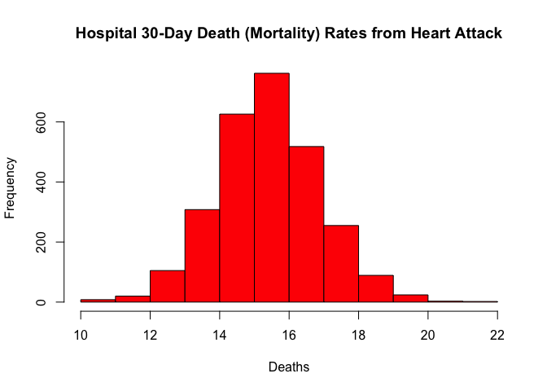

Programming Assignment 3
================
Kirill Avilenko
10/1/2020

## Data information

### Outcome of care measures

The Outcome of Care Measures.csv table contains forty seven (47) fields.
This table provides each hospital’s risk-adjusted 30-Day Death
(mortality) and 30-Day Readmission category and rate.

## Part 1: Plot 30-Days mortality rates from heart attack

In order to plot 30-days mortality rates from heart attack we need to
find and prepare data from “outcome-of-care-measures” table. The
required info is given in column 11, but it is stored as a character.

``` r
outcome <- read.csv("outcome-of-care-measures.csv", colClasses = "character")
str(outcome[,11])
```

    ##  chr [1:4706] "14.3" "18.5" "18.1" "Not Available" "Not Available" ...

Convert data to numeric format and check data:

``` r
outcome[, 11] <- as.numeric(outcome[, 11]);
```

    ## Warning: NAs introduced by coercion

``` r
str(outcome[,11])
```

    ##  num [1:4706] 14.3 18.5 18.1 NA NA NA 17.7 18 15.9 NA ...

Plot the histogram for 30-days mortality rate from heart attack:

``` r
hist(outcome[, 11], 
     main='Hospital 30-Day Death (Mortality) Rates from Heart Attack', 
     xlab='Deaths', 
     col='red')
```

<!-- -->

## Part 2: Best hospital in a state

In order to define best hospital in a state we need to design a function
that takes two arguments: \* 2-character state code \* Outcome name -
“heart attack”, “heart failure” and “pneumonia” and returns hospital
name.

``` r
best <- function(state, outcome) {
    ## Read outcome data
    outcomeTbl <- read.csv("outcome-of-care-measures.csv", colClasses = "character")

    ## Check that state is valid
    if (!state %in% unique(outcomeTbl[['State']])) {
        stop('invalid state') ## Throw an error with information message
    }
    ## Check if outcome is valid
    if (!outcome %in% c('heart attack', 'heart failure', 'pneumonia')) {
        stop('invalid outcome')
    }
    
    ## Rename columns
    colnames(outcomeTbl)[11] <- 'heart attack'
    colnames(outcomeTbl)[17] <- 'heart failure'
    colnames(outcomeTbl)[23] <- 'pneumonia'
    
    ## Filter data by state and select only required columns
    outcomeTbl <- outcomeTbl[outcomeTbl$State == state,
                             c("Hospital.Name",
                               "State",
                               "heart attack",
                               "heart failure",
                               "pneumonia")]
    
    ## Convert data to numeric format (silence warnings when converting text to NA)
    outcomeTbl[, 3:5] <- suppressWarnings(sapply(outcomeTbl[, 3:5], as.numeric))

    ## Filter complete cases (only data without NA)
    outcomeTbl <- outcomeTbl[complete.cases(outcomeTbl), ]
    
    ## Return hospital name in that state with lowest 30-day death ## rate
    return(outcomeTbl[order(outcomeTbl[[outcome]],outcomeTbl$Hospital.Name), ][1,1])
    
}
```

Function tests:

``` r
best("TX", "heart attack")
```

    ## [1] "CYPRESS FAIRBANKS MEDICAL CENTER"

``` r
best("TX", "heart failure")
```

    ## [1] "FORT DUNCAN MEDICAL CENTER"

``` r
best("MD", "heart attack")
```

    ## [1] "JOHNS HOPKINS HOSPITAL, THE"

``` r
best("MD", "pneumonia")
```

    ## [1] "GREATER BALTIMORE MEDICAL CENTER"

## Part 3: Ranking hospitals by outcome in a state

Write a function called **rankhospital** that takes three arguments: the
2-character abbreviated name of a state **(state)**, an outcome
**(outcome)**, and the ranking of a hospital in that state for that
outcome **(num)**. The function reads the
**outcome-of-care-measures.csv** file and returns a character vector
with the name of the hospital that has the ranking specified by the
`num` argument.

``` r
rankhospital <- function(state, outcome, num = "best") { 
    ## Read outcome data
    outcomeTbl <- read.csv("outcome-of-care-measures.csv", colClasses = "character")

    ## Check that state is valid
    if (!state %in% unique(outcomeTbl[['State']])) {
        stop('invalid state') ## Throw an error with information message
    }
    ## Check if outcome is valid
    if (!outcome %in% c('heart attack', 'heart failure', 'pneumonia')) {
        stop('invalid outcome')
    }
    
    ## Rename columns
    colnames(outcomeTbl)[11] <- 'heart attack'
    colnames(outcomeTbl)[17] <- 'heart failure'
    colnames(outcomeTbl)[23] <- 'pneumonia'
    
    ## Filter data by state and select only required columns
    outcomeTbl <- outcomeTbl[outcomeTbl$State == state,
                             c("Hospital.Name",
                               "State",
                               "heart attack",
                               "heart failure",
                               "pneumonia")]
    
    ## Convert data to numeric format (silence warnings when converting text to NA)
    outcomeTbl[, 3:5] <- suppressWarnings(sapply(outcomeTbl[, 3:5], as.numeric))

    ## Filter complete cases (only data without NA)
    outcomeTbl <- outcomeTbl[complete.cases(outcomeTbl), ]
    
    ## Return hospital name in that state with lowest 30-day death ## rate
    if (num == 'best') {
        return(outcomeTbl[order(outcomeTbl[[outcome]],outcomeTbl$Hospital.Name), ][1,1])
        } else if (num == 'worst') {
        return(outcomeTbl[order(-outcomeTbl[[outcome]],outcomeTbl$Hospital.Name), ][1,1])
        } else {
        return(outcomeTbl[order(outcomeTbl[[outcome]],outcomeTbl$Hospital.Name), ][num,1])    
    } 
}
```

Function tests:

``` r
rankhospital("TX", "heart failure", 4)
```

    ## [1] "DETAR HOSPITAL NAVARRO"

``` r
rankhospital("MD", "heart attack", "worst")
```

    ## [1] "HARFORD MEMORIAL HOSPITAL"

``` r
rankhospital("MN", "heart attack", 5000)
```

    ## [1] NA

## Part 4: Ranking hospitals in all states

Write a function called rankall that takes two arguments: an outcome
name (outcome) and a hospital rank- ing (num). The function reads the
outcome-of-care-measures.csv file and returns a 2-column data frame
containing the hospital in each state that has the ranking specified in
num. For example the function call rankall(“heart attack”, “best”) would
return a data frame containing the names of the hospitals that are the
best in their respective states for 30-day heart attack death rates. The
function should return a value for every state (some may be NA). The
first column in the data frame is named hospital, which contains the
hospital name, and the second column is named state, which contains the
2-character abbreviation for the state name. Hospitals that do not have
data on a particular outcome should be excluded from the set of
hospitals when deciding the rankings.

``` r
rankall <- function(outcome, num = "best") { 
    ## Read outcome data
    outcomeTbl <- read.csv("outcome-of-care-measures.csv", colClasses = "character")

    ## Check if outcome is valid
    if (!outcome %in% c('heart attack', 'heart failure', 'pneumonia')) {
        stop('invalid outcome')
    }
    
    ## Rename columns
    colnames(outcomeTbl)[11] <- 'heart attack'
    colnames(outcomeTbl)[17] <- 'heart failure'
    colnames(outcomeTbl)[23] <- 'pneumonia'
    
    ## Select only required columns
    outcomeTbl <- outcomeTbl[, c("Hospital.Name",
                               "State",
                               "heart attack",
                               "heart failure",
                               "pneumonia")]
    
    ## Convert data to numeric format (silence warnings when converting text to NA)
    outcomeTbl[, 3:5] <- suppressWarnings(sapply(outcomeTbl[, 3:5], as.numeric))

    ## Filter complete cases (only data without NA)
    outcomeTbl <- outcomeTbl[complete.cases(outcomeTbl), ]
    
    ## For each state, find the hospital of the given rank
    result <- data.frame()
    for (state in sort(unique(outcomeTbl$State))) {
        ## Filter data by state 
        stOutcomeTbl <- outcomeTbl[outcomeTbl$State == state,]
        ## Checking type of num value
        if (num == 'best') {
        name <- stOutcomeTbl[order(stOutcomeTbl[[outcome]],
                                   stOutcomeTbl$Hospital.Name), ][1,1]
        } else if (num == 'worst') {
        name <- stOutcomeTbl[order(-stOutcomeTbl[[outcome]],
                                 stOutcomeTbl$Hospital.Name), ][1,1]
        } else {
        name <- stOutcomeTbl[order(stOutcomeTbl[[outcome]],
                                 stOutcomeTbl$Hospital.Name), ][num,1] 
        }
        ## Add data to result data frame
        result <- rbind(result,data.frame(name, state))
    }
    
    ## Return a data frame with the hospital names and the
    ## (abbreviated) state name
    names(result) <- c('hospital','state')
    return(result)
}
```

Function tests:

``` r
head(rankall("heart attack", 20), 10)
```

    ##                             hospital state
    ## 1                               <NA>    AK
    ## 2     D W MCMILLAN MEMORIAL HOSPITAL    AL
    ## 3  ARKANSAS METHODIST MEDICAL CENTER    AR
    ## 4                ORO VALLEY HOSPITAL    AZ
    ## 5              SHERMAN OAKS HOSPITAL    CA
    ## 6           SKY RIDGE MEDICAL CENTER    CO
    ## 7            MIDSTATE MEDICAL CENTER    CT
    ## 8                               <NA>    DC
    ## 9                               <NA>    DE
    ## 10    SOUTH FLORIDA BAPTIST HOSPITAL    FL

``` r
tail(rankall("pneumonia", "worst"), 3)
```

    ##                    hospital state
    ## 52 RIVERSIDE MEDICAL CENTER    WI
    ## 53   PLATEAU MEDICAL CENTER    WV
    ## 54   WYOMING MEDICAL CENTER    WY

``` r
tail(rankall("heart failure"), 10)
```

    ##                                                             hospital state
    ## 45                                         CENTENNIAL MEDICAL CENTER    TN
    ## 46                                        FORT DUNCAN MEDICAL CENTER    TX
    ## 47 VA SALT LAKE CITY HEALTHCARE - GEORGE E. WAHLEN VA MEDICAL CENTER    UT
    ## 48                                          SENTARA POTOMAC HOSPITAL    VA
    ## 49                            GOV JUAN F LUIS HOSPITAL & MEDICAL CTR    VI
    ## 50                                              SPRINGFIELD HOSPITAL    VT
    ## 51                                         HARBORVIEW MEDICAL CENTER    WA
    ## 52                                    AURORA ST LUKES MEDICAL CENTER    WI
    ## 53                                         FAIRMONT GENERAL HOSPITAL    WV
    ## 54                                  CHEYENNE REGIONAL MEDICAL CENTER    WY
