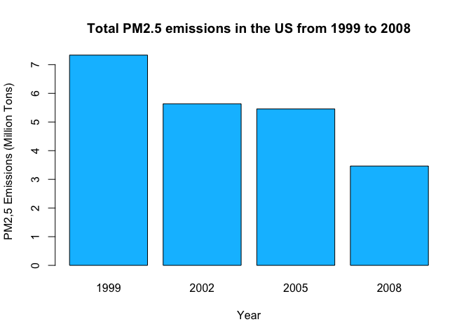
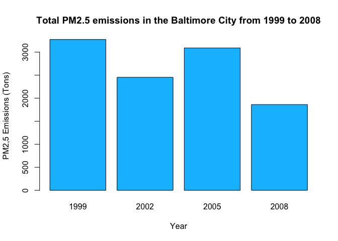
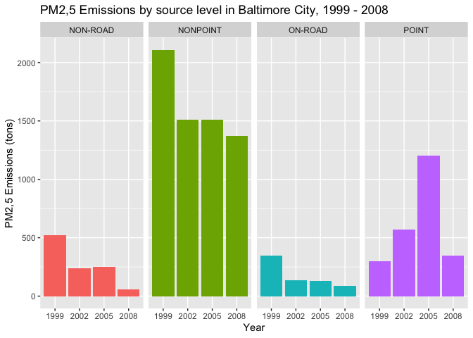
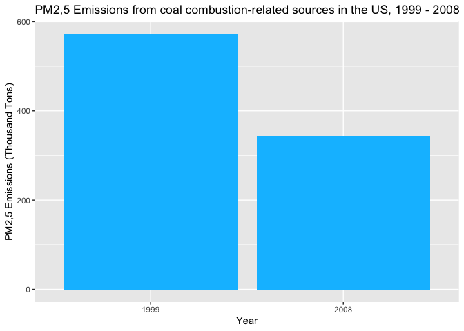
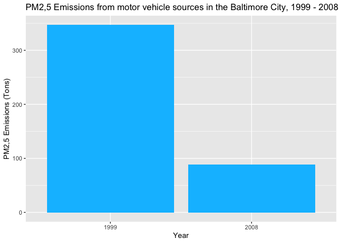
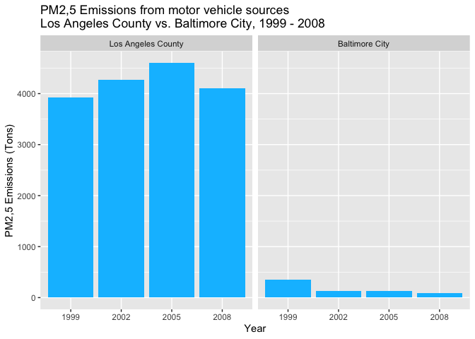

Exploratory Analysis Course Project
================
Kirill Avilenko
10/20/2020

## Assignment

The overall goal of this assignment is to explore the National Emissions
Inventory database and see what it say about fine particulate matter
pollution in the United states over the 10-year period 1999–2008. You
may use any R package you want to support your analysis.

## Questions

You must address the following questions and tasks in your exploratory
analysis. For each question/task you will need to make a single plot.
Unless specified, you can use any plotting system in R to make your
plot.

### Question 1

  - Have total emissions from PM2.5 decreased in the United States from
    1999 to 2008? Using the base plotting system, make a plot showing
    the total PM2.5 emission from all sources for each of the years
    1999, 2002, 2005, and 2008.

<!-- end list -->

``` r
plot1data <- dat %>% select(Pollutant,Emissions,type,year) %>% 
    group_by(year) %>% summarise(sum = sum(Emissions) / 10^6)
barplot(sum~year,data=plot1data,
        main='Total PM2.5 emissions in the US from 1999 to 2008',
        xlab='Year',
        ylab='PM2,5 Emissions (Million Tons)',
        col='deepskyblue')
```

<!-- -->

### Question 2

  - Have total emissions from PM2.5 decreased in the Baltimore City,
    Maryland (fips == “24510”) from 1999 to 2008? Use the base plotting
    system to make a plot answering this question.

<!-- end list -->

``` r
plot2data <- dat %>% select(fips,Pollutant,Emissions,type,year) %>%
    filter(fips == '24510') %>% 
    group_by(year) %>% summarise(sum = sum(Emissions))
barplot(sum~year,data=plot2data,
        main='Total PM2.5 emissions in the Baltimore City from 1999 to 2008',
        xlab='Year',
        ylab='PM2,5 Emissions (Tons)',
        col='deepskyblue')
```

<!-- -->

### Question 3

  - Of the four types of sources indicated by the type (point, nonpoint,
    onroad, nonroad) variable, which of these four sources have seen
    decreases in emissions from 1999–2008 for Baltimore City? Which have
    seen increases in emissions from 1999–2008? Use the ggplot2 plotting
    system to make a plot answer this question.

<!-- end list -->

``` r
plot3data <- dat %>% select(fips,Pollutant,Emissions,type,year) %>%
    filter(fips == '24510') %>% 
    group_by(year,type) %>% summarise(sum = sum(Emissions))
g <- ggplot(plot3data, aes(factor(year),sum,fill=type)) + 
    geom_bar(stat="identity", position='dodge') + facet_grid(.~type) +
    labs(x = 'Year', y = 'PM2,5 Emissions (tons)',
         title = 'PM2,5 Emissions by source level in Baltimore City, 1999 - 2008') +
    guides(fill=FALSE)
g
```

<!-- -->

### Question 4

  - Across the United States, how have emissions from coal
    combustion-related sources changed from 1999–2008?

<!-- end list -->

``` r
plot4data <- dat %>% select(fips,Pollutant,Emissions,type,year,EI.Sector) %>%
    filter((year == '1999' | year == '2008'),
           grepl('Coal',EI.Sector,fixed=TRUE)) %>% 
    group_by(year) %>% 
    summarise(sum = sum(Emissions) / 10^3)
g <- ggplot(plot4data, aes(factor(year),sum)) + 
    geom_bar(stat="identity", position='dodge',fill='deepskyblue') +
    labs(x = 'Year', y = 'PM2,5 Emissions (Thousand Tons)',
         title = 'PM2,5 Emissions from coal combustion-related sources in the US, 1999 - 2008') +
    guides(fill=FALSE)
g
```

<!-- -->

### Question 5

  - How have emissions from motor vehicle sources changed from 1999–2008
    in Baltimore City?

<!-- end list -->

``` r
plot5data <- dat %>% select(fips,Pollutant,Emissions,type,year,EI.Sector) %>%
    filter(fips == '24510',
           (year == '1999' | year == '2008'),
           grepl('Vehicle',EI.Sector,fixed=TRUE)) %>% 
    group_by(year) %>% 
    summarise(sum = sum(Emissions))
g <- ggplot(plot5data, aes(factor(year),sum)) + 
    geom_bar(stat="identity", position='dodge',fill='deepskyblue') +
    labs(x = 'Year', y = 'PM2,5 Emissions (Tons)',
         title = 'PM2,5 Emissions from motor vehicle sources in the Baltimore City, 1999 - 2008') +
    guides(fill=FALSE)
g
```

<!-- -->

### Question 6

  - Compare emissions from motor vehicle sources in Baltimore City with
    emissions from motor vehicle sources in Los Angeles County,
    California (fips == “06037”). Which city has seen greater changes
    over time in motor vehicle emissions?

<!-- end list -->

``` r
plot6data <- dat %>% select(fips,Pollutant,Emissions,type,year,EI.Sector) %>%
    filter(fips == '24510' | fips == '06037',
           grepl('Vehicle',EI.Sector,fixed=TRUE)) %>% 
    group_by(year, fips) %>% 
    summarise(sum = sum(Emissions))
cities = c('06037' = 'Los Angeles County',
           '24510' = 'Baltimore City')
ggplot(plot6data, aes(factor(year),sum)) + 
    geom_bar(stat="identity", position='dodge',fill='deepskyblue') +
    facet_grid(.~fips, labeller = labeller(fips = cities)) +
    labs(x = 'Year', y = 'PM2,5 Emissions (Tons)',
         title = 'PM2,5 Emissions from motor vehicle sources 
Los Angeles County vs. Baltimore City, 1999 - 2008')
```

<!-- -->
