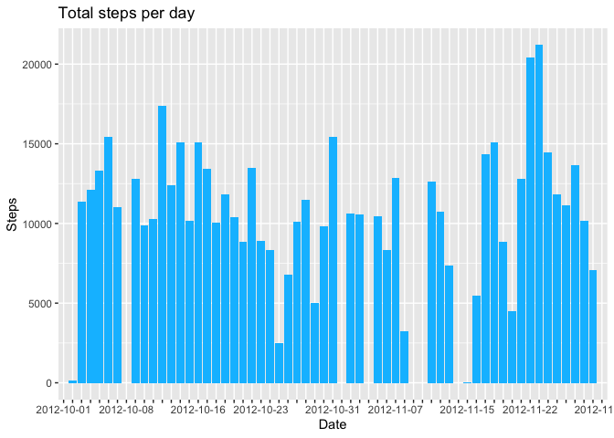
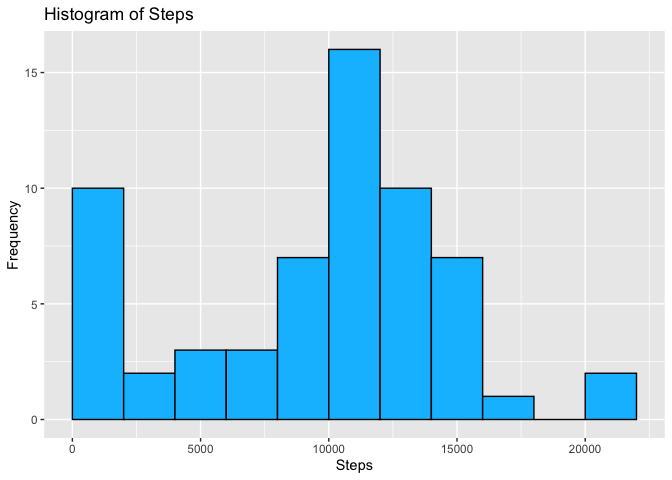
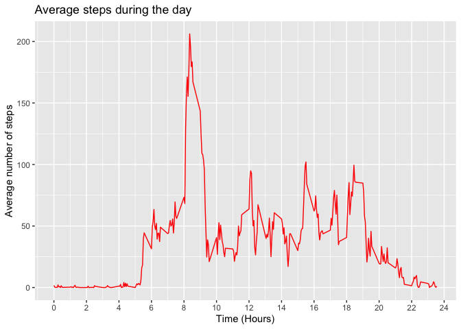
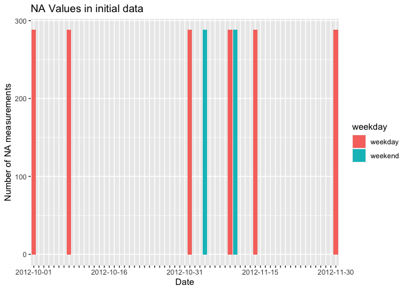
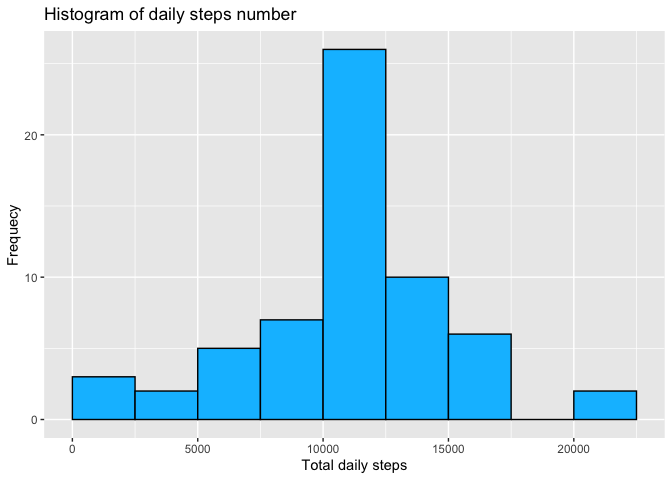
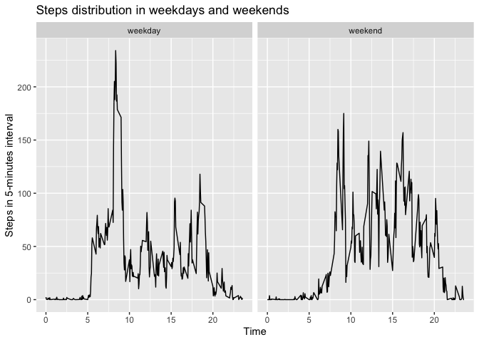

Reproducible Research Course Project
================
Kirill Avilenko
10/22/2020

## Loading and preprocessing the data

``` r
dat <- read.csv('data/activity.csv')
dim(dat)
```

    ## [1] 17568     3

``` r
head(dat)
```

    ##   steps       date interval
    ## 1    NA 2012-10-01        0
    ## 2    NA 2012-10-01        5
    ## 3    NA 2012-10-01       10
    ## 4    NA 2012-10-01       15
    ## 5    NA 2012-10-01       20
    ## 6    NA 2012-10-01       25

``` r
str(dat)
```

    ## 'data.frame':    17568 obs. of  3 variables:
    ##  $ steps   : int  NA NA NA NA NA NA NA NA NA NA ...
    ##  $ date    : chr  "2012-10-01" "2012-10-01" "2012-10-01" "2012-10-01" ...
    ##  $ interval: int  0 5 10 15 20 25 30 35 40 45 ...

As we can see, activity data consists of 3 variables:  
1\. steps - integer value of steps, missed measurements are filled with
NA  
2\. date - chr type, to be converted to Date format.  
3\. interval - int type, hours and minutes without delimiters. In order
to process this variable we can simply divide it by 100, so that 2345
becomes 23.45, where 23 means hours and 45 means minutes.

``` r
dat <- dat %>% mutate(date = as.factor(ymd(date)),
                      interval = interval/100)
str(dat)
```

    ## 'data.frame':    17568 obs. of  3 variables:
    ##  $ steps   : int  NA NA NA NA NA NA NA NA NA NA ...
    ##  $ date    : Factor w/ 61 levels "2012-10-01","2012-10-02",..: 1 1 1 1 1 1 1 1 1 1 ...
    ##  $ interval: num  0 0.05 0.1 0.15 0.2 0.25 0.3 0.35 0.4 0.45 ...

``` r
summary(dat)
```

    ##      steps                date          interval     
    ##  Min.   :  0.00   2012-10-01:  288   Min.   : 0.000  
    ##  1st Qu.:  0.00   2012-10-02:  288   1st Qu.: 5.888  
    ##  Median :  0.00   2012-10-03:  288   Median :11.775  
    ##  Mean   : 37.38   2012-10-04:  288   Mean   :11.775  
    ##  3rd Qu.: 12.00   2012-10-05:  288   3rd Qu.:17.663  
    ##  Max.   :806.00   2012-10-06:  288   Max.   :23.550  
    ##  NA's   :2304     (Other)   :15840

As we see from data summary and structure, there are **2304** NA values
in steps column and measurements are taken during **61** days.

## What is mean total number of steps taken per day?

For this part of the assignment, you can ignore the missing values in
the dataset.

1.  Calculate the total number of steps taken per day

<!-- end list -->

``` r
# Filter activity data by date, sum steps and print 
q1dat <- dat %>% group_by(date) %>% 
    summarise(total = sum(steps,na.rm=TRUE)) %>%
    arrange(desc(total))
```

    ## `summarise()` ungrouping output (override with `.groups` argument)

``` r
# Top 10 days by steps number
head(q1dat,10)
```

    ## # A tibble: 10 x 2
    ##    date       total
    ##    <fct>      <int>
    ##  1 2012-11-23 21194
    ##  2 2012-11-22 20427
    ##  3 2012-10-12 17382
    ##  4 2012-10-06 15420
    ##  5 2012-10-31 15414
    ##  6 2012-11-18 15110
    ##  7 2012-10-14 15098
    ##  8 2012-10-16 15084
    ##  9 2012-11-24 14478
    ## 10 2012-11-17 14339

``` r
# 10 days with lowest number of steps
tail(q1dat,10)
```

    ## # A tibble: 10 x 2
    ##    date       total
    ##    <fct>      <int>
    ##  1 2012-10-02   126
    ##  2 2012-11-15    41
    ##  3 2012-10-01     0
    ##  4 2012-10-08     0
    ##  5 2012-11-01     0
    ##  6 2012-11-04     0
    ##  7 2012-11-09     0
    ##  8 2012-11-10     0
    ##  9 2012-11-14     0
    ## 10 2012-11-30     0

From the last table we see that there are 8 days for which measurements
are missed.

2.  If you do not understand the difference between a histogram and a
    barplot, research the difference between them. Make a histogram of
    the total number of steps taken each day

<!-- end list -->

``` r
# Bar plot - steps ~ days
ggplot(q1dat, aes(date, total)) + geom_bar(stat='identity', fill='deepskyblue') +
    labs(title='Total steps per day') +
    xlab('Date') +
    ylab('Steps') + 
    scale_x_discrete(guide = guide_axis(check.overlap = TRUE))
```

<!-- -->

``` r
# Histogram of steps
ggplot(q1dat, aes(total)) + geom_histogram(fill='deepskyblue',
                                           color='black',
                                           binwidth=2000,
                                           center=1000) +
    labs(title='Histogram of Steps') +
    xlab('Steps') +
    ylab('Frequency')
```

<!-- -->

3.  Calculate and report the mean and median of the total number of
    steps taken per day

<!-- end list -->

``` r
# Mean
mean(q1dat$total)
```

    ## [1] 9354.23

``` r
# Median
median(q1dat$total)
```

    ## [1] 10395

## What is the average daily activity pattern?

1.  Make a time series plot (i.e. type = “l”) of the 5-minute interval
    (x-axis) and the average number of steps taken, averaged across all
    days (y-axis)

<!-- end list -->

``` r
# Group data by time interval and count mean number of steps
q2dat <- dat %>% group_by(interval) %>% summarise(mean = mean(steps, na.rm=TRUE))

# Plot time series
ggplot(q2dat,aes(interval,mean)) + geom_line(color='red') + 
    labs(title = 'Average steps during the day') +
    xlab('Time (Hours)') + 
    ylab('Average number of steps') +
    scale_x_continuous(breaks=seq(0,24,2))
```

<!-- -->

2.  Which 5-minute interval, on average across all the days in the
    dataset, contains the maximum number of steps?

<!-- end list -->

``` r
q2dat[which.max(q2dat$mean),]$interval
```

    ## [1] 8.35

## Imputing missing values

Note that there are a number of days/intervals where there are missing
values (coded as NA). The presence of missing days may introduce bias
into some calculations or summaries of the data.

1.  Calculate and report the total number of missing values in the
    dataset (i.e. the total number of rows with NAs)

<!-- end list -->

``` r
sum(is.na(dat$steps))
```

    ## [1] 2304

2.  Devise a strategy for filling in all of the missing values in the
    dataset. The strategy does not need to be sophisticated. For
    example, you could use the mean/median for that day, or the mean for
    that 5-minute interval, etc.

<!-- end list -->

``` r
temp <- dat %>% group_by(date) %>% 
    summarise(na = sum(is.na(steps))) %>% 
    mutate(weekday = as.factor(ifelse(is.weekend(date),
                                                  'weekend',
                                                  'weekday')))
ggplot(temp, aes(date,na,fill=weekday)) + geom_bar(stat='identity') +
    labs(title='NA Values in initial data') +
    xlab('Date') +
    ylab('Number of NA measurements') +
    scale_x_discrete(guide = guide_axis(check.overlap = TRUE))
```

<!-- --> Because all there
are 8 days in data that have all measurements absent, we replace them
with mean of the corresponding time interval considering
weekdays/weekends difference.

3.  Create a new dataset that is equal to the original dataset but with
    the missing data filled in.

<!-- end list -->

``` r
dat1 <- dat %>% mutate(weekday = as.factor(ifelse(is.weekend(date),
                                                  'weekend',
                                                  'weekday'))) %>%
    group_by(interval, weekday) %>% 
    mutate(steps = ifelse(is.na(steps),
                          mean(steps,na.rm=TRUE),
                          steps)) %>%
    ungroup()

# Number of NA values after transformation
sum(is.na(dat1$steps))
```

    ## [1] 0

4.  Make a histogram of the total number of steps taken each day and
    Calculate and report the mean and median total number of steps taken
    per day. Do these values differ from the estimates from the first
    part of the assignment? What is the impact of imputing missing data
    on the estimates of the total daily number of steps?

<!-- end list -->

``` r
StepsPerDay <-  dat1 %>% group_by(date) %>% summarise(total = sum(steps))
ggplot(StepsPerDay, aes(total)) + geom_histogram(binwidth=2500, 
                                                 center=1250, 
                                                 color='black',
                                                 fill='deepskyblue') +
    labs(title='Histogram of daily steps number') +
    xlab('Total daily steps') +
    ylab('Frequecy') 
```

<!-- -->

``` r
# Mean
mean(StepsPerDay$total)
```

    ## [1] 10762.05

``` r
# Median
median(StepsPerDay$total)
```

    ## [1] 10571

## Are there differences in activity patterns between weekdays and weekends?

For this part the weekdays() function may be of some help here. Use the
dataset with the filled-in missing values for this part.

1.  Create a new factor variable in the dataset with two levels –
    “weekday” and “weekend” indicating whether a given date is a
    weekday or weekend day.

<!-- end list -->

``` r
dat2 <- dat %>% mutate(weekday = as.factor(ifelse(is.weekend(date),
                                                  'weekend',
                                                  'weekday'))) 
```

2.  Make a panel plot containing a time series plot (i.e. type = “l”) of
    the 5-minute interval (x-axis) and the average number of steps
    taken, averaged across all weekday days or weekend days (y-axis).
    The plot should look something like the following, which was created
    using simulated data:

<!-- end list -->

``` r
ggplot(dat2,aes(interval,steps)) + geom_line(stat='summary', fun='mean') +
    facet_grid(.~weekday) +
    xlab('Time') +
    ylab('Steps in 5-minutes interval') +
    labs(title = 'Steps distribution in weekdays and weekends')
```

<!-- -->
