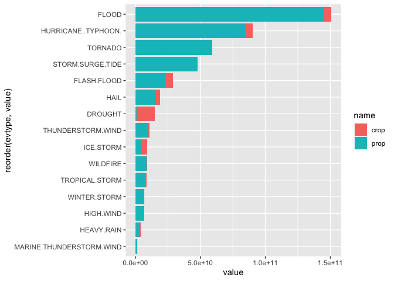

Impact from severe weather events on population and economics
================
Kirill Avilenko
11/02/2020

## Synopsis

Storms and other severe weather events can cause both public health and
economic problems for communities and municipalities. Many severe events
can result in fatalities, injuries, and property damage, and preventing
such outcomes to the extent possible is a key concern.

This project involves exploring the U.S. National Oceanic and
Atmospheric Administration’s (NOAA) storm database. This database tracks
characteristics of major storms and weather events in the United States,
including when and where they occur, as well as estimates of any
fatalities, injuries, and property damage.

The research showed that absolute leader in health impact are tornadoes,
followed by thunderstorm wind, heat, flood and lightnings. However from
the economics point of view tornadoes are only on the third place,
loosing to floods and hurricanes. Also an interesting fact is that from
the worst event types from economical point of view only two showed crop
damage higher than property damage - it is drought and ice storm.

## Data Processing

### Initial setup

As a basic settings fixed notation for numbers code visibility are set.
Additionally required packages for data processing and visualization are
loaded.

``` r
# Load packages
library(tidyverse)
library(lubridate)
library(stringdist)
options(scipen=1) # Choose fixed notation for numbers visualization
```

### Download and read data

The source data and corresponding documentation are loaded and stored in
the ‘data’ directory. In order to speedup report generation process,
download is skipped if ‘data’ directory already contains files.

``` r
# Urls for data and documentation
dataurl <- 'https://d396qusza40orc.cloudfront.net/repdata%2Fdata%2FStormData.csv.bz2'
docurl <- 'https://d396qusza40orc.cloudfront.net/repdata%2Fpeer2_doc%2Fpd01016005curr.pdf'
faqurl <- 'https://d396qusza40orc.cloudfront.net/repdata%2Fpeer2_doc%2FNCDC%20Storm%20Events-FAQ%20Page.pdf'

# Check if data is already in data folder and download data if not
if (!'storm.csv.bz2' %in% dir('./data/')) {
    download.file(url=dataurl,destfile = 'data/storm.csv.bz2')}
if (!'storm.pdf' %in% dir('./data/')) {
    download.file(url=docurl,destfile = 'data/storm.pdf')}
if (!'faq.pdf' %in% dir('./data/')) {
    download.file(url=faqurl, destfile = 'data/faq.pdf')}
rm('dataurl','docurl','faqurl') # Clear environment from urls
```

If environment doesn’t contain rawData, then we read it from csv file.

``` r
if (!'rawData' %in% ls()) {
    rawData <- read.csv('data/storm.csv.bz2')}
```

### Data overview

Let’s look at the data header.

``` r
head(rawData,2)
```

    ##   STATE__          BGN_DATE BGN_TIME TIME_ZONE COUNTY COUNTYNAME STATE  EVTYPE
    ## 1       1 4/18/1950 0:00:00     0130       CST     97     MOBILE    AL TORNADO
    ## 2       1 4/18/1950 0:00:00     0145       CST      3    BALDWIN    AL TORNADO
    ##   BGN_RANGE BGN_AZI BGN_LOCATI END_DATE END_TIME COUNTY_END COUNTYENDN
    ## 1         0                                               0         NA
    ## 2         0                                               0         NA
    ##   END_RANGE END_AZI END_LOCATI LENGTH WIDTH F MAG FATALITIES INJURIES PROPDMG
    ## 1         0                        14   100 3   0          0       15    25.0
    ## 2         0                         2   150 2   0          0        0     2.5
    ##   PROPDMGEXP CROPDMG CROPDMGEXP WFO STATEOFFIC ZONENAMES LATITUDE LONGITUDE
    ## 1          K       0                                         3040      8812
    ## 2          K       0                                         3042      8755
    ##   LATITUDE_E LONGITUDE_ REMARKS REFNUM
    ## 1       3051       8806              1
    ## 2          0          0              2

For purposes of this analysis the following columns will be used:  
\- BGN\_DATE - data of event - EVTYPE - type of event - FATALITIES -
number of fatalities - INJURIES - number of injuries - PROPDMG -
property damage - PROPDMGEXP - units for property damage - CROPDMG -
crop damage - CROPDMGEXP - units for crop damage

Further analysis will be performed on data subset with these variables
only. Also we’ll work only on events that have at least one fatality or
injury, or any kind of damage is more than zero.

``` r
data <- rawData %>% select(BGN_DATE, EVTYPE, FATALITIES, INJURIES, 
                        PROPDMG, PROPDMGEXP, CROPDMG, CROPDMGEXP) %>%
    filter(FATALITIES > 0 | INJURIES > 0 | PROPDMG >0 | CROPDMG > 0)
summary(data)
```

    ##    BGN_DATE            EVTYPE            FATALITIES          INJURIES        
    ##  Length:254633      Length:254633      Min.   :  0.0000   Min.   :   0.0000  
    ##  Class :character   Class :character   1st Qu.:  0.0000   1st Qu.:   0.0000  
    ##  Mode  :character   Mode  :character   Median :  0.0000   Median :   0.0000  
    ##                                        Mean   :  0.0595   Mean   :   0.5519  
    ##                                        3rd Qu.:  0.0000   3rd Qu.:   0.0000  
    ##                                        Max.   :583.0000   Max.   :1700.0000  
    ##     PROPDMG         PROPDMGEXP           CROPDMG         CROPDMGEXP       
    ##  Min.   :   0.00   Length:254633      Min.   :  0.000   Length:254633     
    ##  1st Qu.:   2.00   Class :character   1st Qu.:  0.000   Class :character  
    ##  Median :   5.00   Mode  :character   Median :  0.000   Mode  :character  
    ##  Mean   :  42.75                      Mean   :  5.411                     
    ##  3rd Qu.:  25.00                      3rd Qu.:  0.000                     
    ##  Max.   :5000.00                      Max.   :990.000

### Data transformation

For exploration of economic impact we need to calculate property and
crop damage from corresponding columns. Also BGN\_DATE column should be
converted from chr to Date.

``` r
data <- data %>% mutate(BGN_DATE = mdy_hms(BGN_DATE))
```

Let’s look at all values in PROPDMGEXP

``` r
table(data$PROPDMGEXP)
```

    ## 
    ##             -      +      0      2      3      4      5      6      7      B 
    ##  11585      1      5    210      1      1      4     18      3      3     40 
    ##      h      H      K      m      M 
    ##      1      6 231428      7  11320

From the summary above we see that PROPDMGEXP field has three groups of
values: 1. Alphabetic multipliers 2. Numeric multipliers 3. Special
characters

Numeric and alpabetic multipliers will be handled as they state, special
characters will be considered as 0.

Let’s look at CROPDMGEXP field:

``` r
table(data$CROPDMGEXP)
```

    ## 
    ##             ?      0      B      k      K      m      M 
    ## 152664      6     17      7     21  99932      1   1985

Situation here is the same, so we process crop damage data as property
damage.

``` r
# Function for clean up PROPDMGEXP and CROPDMGEXP
tidyDMGEXP <- function(value) {
    return(case_when(
        toupper(value) == 'H' ~ 10^2,
        toupper(value) == 'K' ~ 10^3,
        toupper(value) == 'M' ~ 10^6,
        toupper(value) == 'B' ~ 10^9,
        is.numeric(value) ~ 10^as.numeric(value),
        TRUE ~ 1
    ))
}

data <- data %>% 
    mutate(cleanPROPDMGEXP = tidyDMGEXP(PROPDMGEXP),
           cleanCROPDMGEXP = tidyDMGEXP(CROPDMGEXP),
           propdmg = PROPDMG * cleanPROPDMGEXP,
           cropdmg = CROPDMG * cleanCROPDMGEXP)
```

Number of unique event types in EVTYPE colunm

``` r
length(unique(data$EVTYPE))
```

    ## [1] 488

In order to eliminate the most common mismatch reasons EVTYPE column
values should be:

1.  Capitalized  
2.  Trimmed  
3.  Cleaned from punctuation  
4.  Removed abbreviations  
5.  Removed rows that contain ‘summary’

<!-- end list -->

``` r
data <- data %>% 
    mutate(EVTYPE = gsub("[[:punct:]]", " ", toupper(str_squish(EVTYPE)))) %>%
    mutate(EVTYPE = gsub("TSTM", "THUNDERSTORM", EVTYPE)) %>%
    filter(!grepl('SUMMARY',EVTYPE))
```

``` r
data %>% group_by(EVTYPE) %>% summarise(count=n()) %>% arrange(desc(count))
```

    ## `summarise()` ungrouping output (override with `.groups` argument)

    ## # A tibble: 422 x 2
    ##    EVTYPE              count
    ##    <chr>               <int>
    ##  1 THUNDERSTORM WIND  106892
    ##  2 TORNADO             39944
    ##  3 HAIL                26130
    ##  4 FLASH FLOOD         20968
    ##  5 LIGHTNING           13293
    ##  6 THUNDERSTORM WINDS  12094
    ##  7 FLOOD               10175
    ##  8 HIGH WIND            5522
    ##  9 STRONG WIND          3372
    ## 10 WINTER STORM         1508
    ## # … with 412 more rows

Section 7 of the documentations says that there are 48 types of events,
and after preliminary processing of the EVTYPE column there are 422
unique event types.  
In order to clean up the list we use

``` r
events <- gsub("[[:punct:]]"," ",toupper(c("Astronomical Low Tide", "Avalanche",
"Blizzard", "Coastal Flood", "Cold/Wind Chill",
"Debris Flow","Dense Fog", "Dense Smoke", "Drought", "Dust Devil", "Dust Storm", 
"Excessive Heat", "Extreme Cold/Wind Chill", "Flash Flood", "Flood", "Frost/Freeze", 
"Funnel Cloud", "Freezing Fog", "Hail", "Heat", "Heavy Rain", "Heavy Snow", "High Surf", "High Wind", "Hurricane (Typhoon)", "Ice Storm", "Lake-Effect Snow", 
"Lakeshore Flood", "Lightning", "Marine Hail", "Marine High Wind", 
"Marine Strong Wind", "Marine Thunderstorm Wind", "Rip Current", "Seiche", 
"Sleet", "Storm Surge/Tide", "Strong Wind", "Thunderstorm Wind", "Tornado", 
"Tropical Depression", "Tropical Storm", "Tsunami", "Volcanic Ash", "Waterspout",
"Wildfire", "Winter Storm","Winter Weather")))

distmatrix<-stringdistmatrix(unique(data$EVTYPE),
                            events, useNames=TRUE ,method = 'jw') %>%
    data.frame() %>% rownames_to_column() 


matchnames <- distmatrix %>% 
    pivot_longer(!rowname) %>% 
    group_by(rowname) %>% 
    slice(which.min(value)) %>% 
    arrange(desc(value)) %>% 
    rename(EVTYPE = 'rowname')

data <- data %>% left_join(matchnames,by='EVTYPE') %>% 
    select(FATALITIES, INJURIES, propdmg, cropdmg, name) %>%
    rename(evtype = 'name',
           fat = 'FATALITIES',
           inj = 'INJURIES') %>% as_tibble()
```

## Results

### Public health impact

Public health impact mostly depends on fatalities number so data is
sorted by fatalities number and then by injuries number. Below numbers
for the TOP 10 most harmful event types are given:

``` r
# Health
data %>% select(fat,inj,evtype) %>% group_by(evtype) %>% 
    summarise(Fatalities=sum(fat),Injuries=sum(inj)) %>% 
    arrange(desc(Fatalities)) %>% head(10)
```

    ## `summarise()` ungrouping output (override with `.groups` argument)

    ## # A tibble: 10 x 3
    ##    evtype                  Fatalities Injuries
    ##    <chr>                        <dbl>    <dbl>
    ##  1 TORNADO                       5658    91368
    ##  2 EXCESSIVE.HEAT                2018     6703
    ##  3 HEAT                          1119     2494
    ##  4 FLASH.FLOOD                   1076     1855
    ##  5 LIGHTNING                      818     5234
    ##  6 THUNDERSTORM.WIND              712     9513
    ##  7 RIP.CURRENT                    580      557
    ##  8 FLOOD                          543     7527
    ##  9 EXTREME.COLD.WIND.CHILL        305      260
    ## 10 HIGH.WIND                      299     1519

Graphical representation of TOP-10 event types sorted by overall number
of people affected by.

``` r
healthdata <- data %>% select(fat,inj,evtype) %>% group_by(evtype) %>% 
    summarise(Fatalities=sum(fat),Injuries=sum(inj)) %>% 
    arrange(desc(Fatalities)) %>% head(10) %>%
    pivot_longer(cols=-c('evtype'))
```

    ## `summarise()` ungrouping output (override with `.groups` argument)

``` r
ggplot(data=healthdata, aes(x=reorder(evtype,value),
                            y=value,
                            fill=name)) + 
    geom_bar(stat='identity') + 
    coord_flip() + facet_grid(~name,scale='free') +
    xlab('Type of event') +
    ylab('Health impact, people') +
    labs(title='Health impact from various weather events') + 
    theme(legend.position = "none")
```

<!-- -->

From the diagram above we see that absolute leader in both fatalities
and injuries categories are Tornados.

### Economics impact

From the table data of 15 worst weather event types from the economics
point of view we find out that:  
1\. Most of cases property damages are much higher than crop damages,
but there are two cases - drought and ice storm - where we see the
opposite situation.

``` r
data %>% select(propdmg,cropdmg,evtype) %>% group_by(evtype) %>% 
    summarise(prop=sum(propdmg),crop=sum(cropdmg)) %>% arrange(desc(prop)) %>% head(15)
```

    ## `summarise()` ungrouping output (override with `.groups` argument)

    ## # A tibble: 15 x 3
    ##    evtype                            prop        crop
    ##    <chr>                            <dbl>       <dbl>
    ##  1 FLOOD                    144918525915   5812065450
    ##  2 HURRICANE..TYPHOON.       84756180010   5515292800
    ##  3 TORNADO                   58542034529.   417463020
    ##  4 STORM.SURGE.TIDE          47967689000       855000
    ##  5 FLASH.FLOOD               22374975207.  6587596650
    ##  6 HAIL                      15973969543.  3026044473
    ##  7 THUNDERSTORM.WIND          9763515756.  1226498388
    ##  8 WILDFIRE                   8500258000    403081630
    ##  9 TROPICAL.STORM             7714890600    694896050
    ## 10 WINTER.STORM               6749912751     33004000
    ## 11 HIGH.WIND                  6005609693    686562050
    ## 12 ICE.STORM                  3963054860   5022113500
    ## 13 HEAVY.RAIN                 3245215140    795755800
    ## 14 MARINE.THUNDERSTORM.WIND   1214632400     46250000
    ## 15 DROUGHT                    1046298000  13972571780

``` r
# Economics
econdata <- data %>% select(propdmg,cropdmg,evtype) %>% group_by(evtype) %>% 
    summarise(prop=sum(propdmg),crop=sum(cropdmg)) %>% arrange(desc(prop)) %>% head(15) %>%
    pivot_longer(cols=-c('evtype'))
```

    ## `summarise()` ungrouping output (override with `.groups` argument)

``` r
ggplot(data=econdata, 
       aes(x=reorder(evtype,value), y=value, fill=name)) + 
    geom_bar(stat='identity') + 
    coord_flip()
```

<!-- -->

## Auxilaries

### Structure of the raw dataset

``` r
str(rawData)
```

    ## 'data.frame':    902297 obs. of  37 variables:
    ##  $ STATE__   : num  1 1 1 1 1 1 1 1 1 1 ...
    ##  $ BGN_DATE  : chr  "4/18/1950 0:00:00" "4/18/1950 0:00:00" "2/20/1951 0:00:00" "6/8/1951 0:00:00" ...
    ##  $ BGN_TIME  : chr  "0130" "0145" "1600" "0900" ...
    ##  $ TIME_ZONE : chr  "CST" "CST" "CST" "CST" ...
    ##  $ COUNTY    : num  97 3 57 89 43 77 9 123 125 57 ...
    ##  $ COUNTYNAME: chr  "MOBILE" "BALDWIN" "FAYETTE" "MADISON" ...
    ##  $ STATE     : chr  "AL" "AL" "AL" "AL" ...
    ##  $ EVTYPE    : chr  "TORNADO" "TORNADO" "TORNADO" "TORNADO" ...
    ##  $ BGN_RANGE : num  0 0 0 0 0 0 0 0 0 0 ...
    ##  $ BGN_AZI   : chr  "" "" "" "" ...
    ##  $ BGN_LOCATI: chr  "" "" "" "" ...
    ##  $ END_DATE  : chr  "" "" "" "" ...
    ##  $ END_TIME  : chr  "" "" "" "" ...
    ##  $ COUNTY_END: num  0 0 0 0 0 0 0 0 0 0 ...
    ##  $ COUNTYENDN: logi  NA NA NA NA NA NA ...
    ##  $ END_RANGE : num  0 0 0 0 0 0 0 0 0 0 ...
    ##  $ END_AZI   : chr  "" "" "" "" ...
    ##  $ END_LOCATI: chr  "" "" "" "" ...
    ##  $ LENGTH    : num  14 2 0.1 0 0 1.5 1.5 0 3.3 2.3 ...
    ##  $ WIDTH     : num  100 150 123 100 150 177 33 33 100 100 ...
    ##  $ F         : int  3 2 2 2 2 2 2 1 3 3 ...
    ##  $ MAG       : num  0 0 0 0 0 0 0 0 0 0 ...
    ##  $ FATALITIES: num  0 0 0 0 0 0 0 0 1 0 ...
    ##  $ INJURIES  : num  15 0 2 2 2 6 1 0 14 0 ...
    ##  $ PROPDMG   : num  25 2.5 25 2.5 2.5 2.5 2.5 2.5 25 25 ...
    ##  $ PROPDMGEXP: chr  "K" "K" "K" "K" ...
    ##  $ CROPDMG   : num  0 0 0 0 0 0 0 0 0 0 ...
    ##  $ CROPDMGEXP: chr  "" "" "" "" ...
    ##  $ WFO       : chr  "" "" "" "" ...
    ##  $ STATEOFFIC: chr  "" "" "" "" ...
    ##  $ ZONENAMES : chr  "" "" "" "" ...
    ##  $ LATITUDE  : num  3040 3042 3340 3458 3412 ...
    ##  $ LONGITUDE : num  8812 8755 8742 8626 8642 ...
    ##  $ LATITUDE_E: num  3051 0 0 0 0 ...
    ##  $ LONGITUDE_: num  8806 0 0 0 0 ...
    ##  $ REMARKS   : chr  "" "" "" "" ...
    ##  $ REFNUM    : num  1 2 3 4 5 6 7 8 9 10 ...
