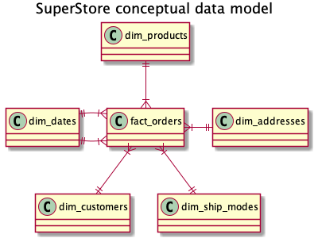
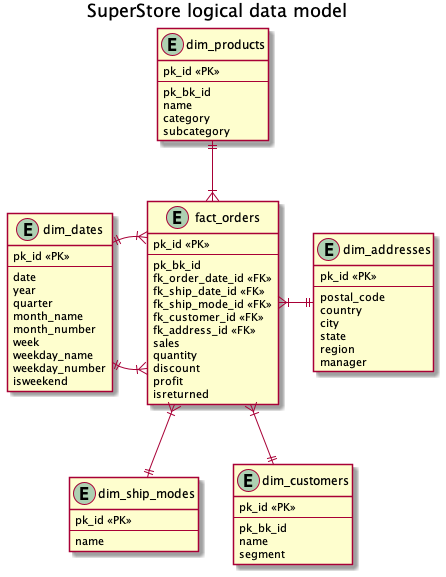
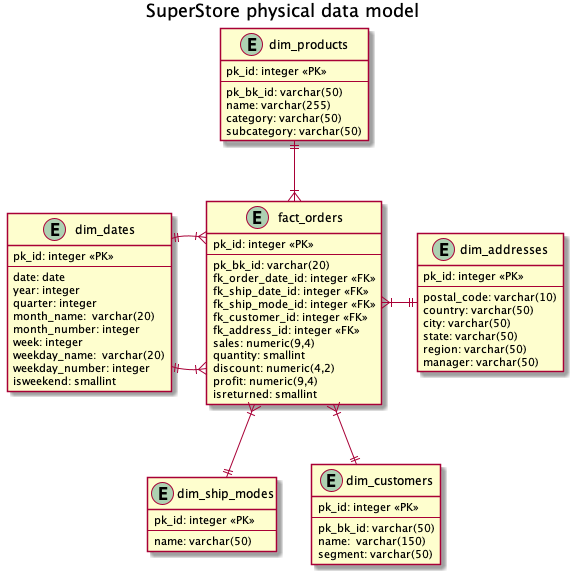
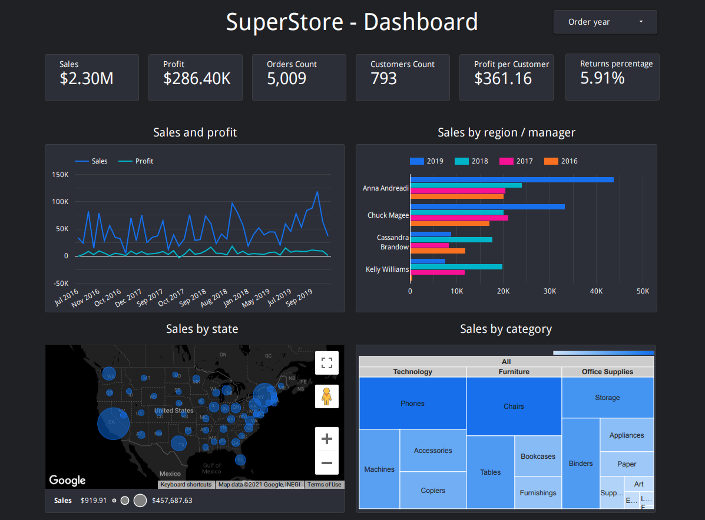

# DE-101 Module 2 Homework

Homework task available in [DE-101 course repository](https://github.com/Data-Learn/data-engineering/blob/master/DE-101%20Modules/Module02/DE%20-%20101%20Module02.md)

## 2.3 - SQL queries

1. Save initial excel file to csv


```
python save_to_csv.py
```

2. Initialize database and insert tables into it
```
docker-compose up -d
```
This command will run PostgreSQL database and fill it with data from csv files created in step 1.

3. Run queries

Queries are located in ["queries"](./3/queries/) folder  that is linked to the postgres docker container.

Run pgcli from command line:            
```
pgcli -h localhost -U postgres
```
To get query results run in pgcli:
```
\i queries/total_sales.sql
```

## 2.4 - Data modelling

### Task
Design Dimensional Model for initial [Superstore Excel File](./3/initial_data/Sample%20-%20Superstore.xls):

### Solution
- Conceptual model
  
  
- Logical model
  
  
- Physical model
  
  

## 2.6 - Dashboarding

Google Data Studio [SuperStore - Dashboard](https://datastudio.google.com/reporting/5add7a09-8a66-4b58-9939-13fbe9403d28) connected to PostgreSQL database on AWS Lightsail instance.

