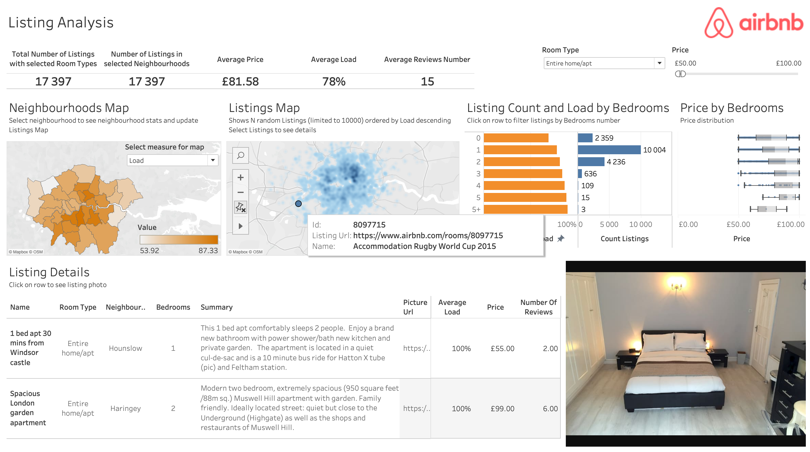

# DE-101 Module 3 Homework

## 3.8 Introduction to Tableau Desktop

As a practice for module 3.8 I've passed a Tableau Author learning path at [Tableau eLearning](https://elearning.tableau.com) and got a certificate of completion:

## Capstone project

### Task

Based on London Airbnb dataset solve one of the following tasks:

1. Analytical tool

In order to find a new object, you need to choose the most attractive neighbourhood and compare specific objects. Neighbourhoods and listings should be compared by the following criteria:

- Number of listings
- Average proce
- Average occupancy (load)
- Room type
- Bedrooms number

The dashboard should andser the question in which neighbourhood is it worth renting a room and analyse top offers (by occupancy) in the area.

### Dataset description

The dataset consists of the following files:

- listings.csv — detailed info about each real estate object
- listings_summary.csv — summarised info about each real estate object
- calendar.csv — real estate object availability schedule
- neighbourhoods.csv — district list
- neighbourhoods.geojson — district spatial data
- reviews.csv — object reviews
- reviews_summary.csv — object reviews summary

In order to solve the problem decided to use data from reviews.csv, reviews_summary.csv and neighbourhoods.geojson

### Result

Link to the dashboard stored on Tableau Public: [DE-101 Airbnb Listing Analytics](https://public.tableau.com/app/profile/kirill.avilenko8209/viz/DE-101AirbnbListingsAnalysis/ListingAnalysis)

Screenshot of the dashboard:

