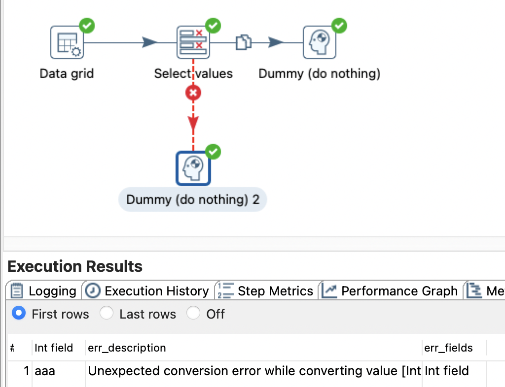
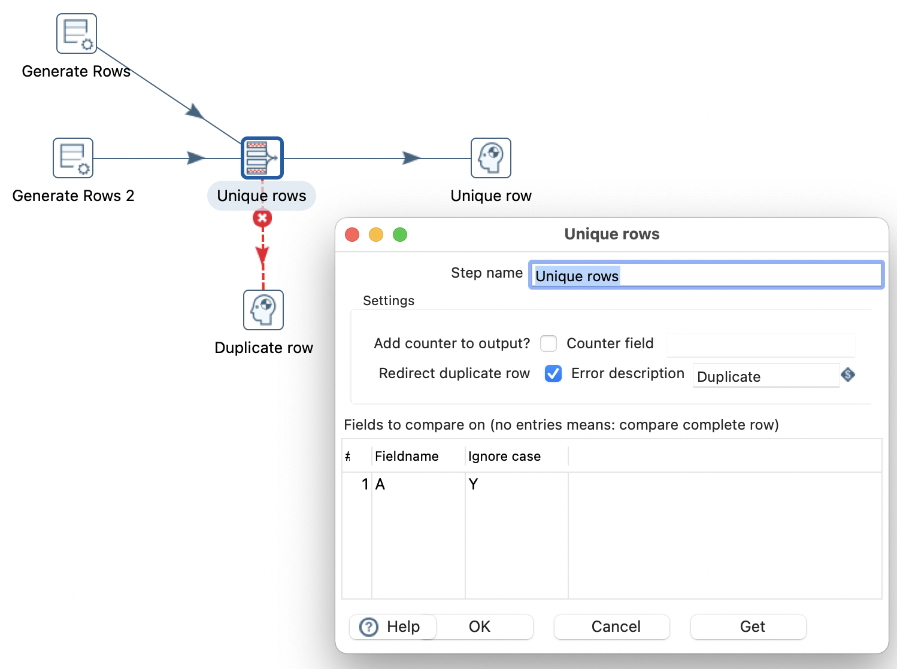
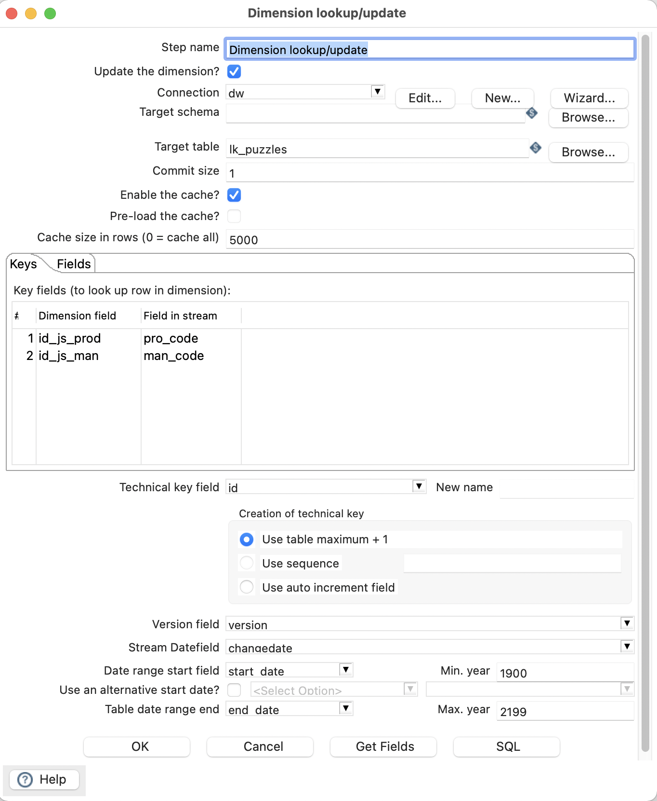
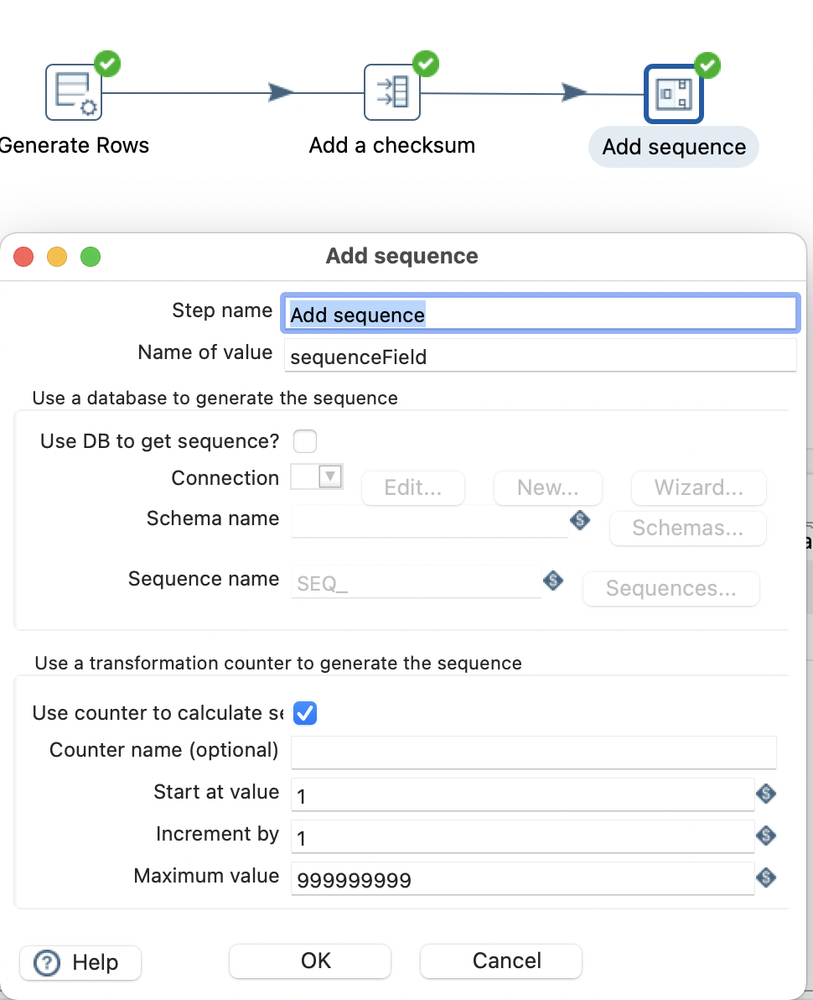
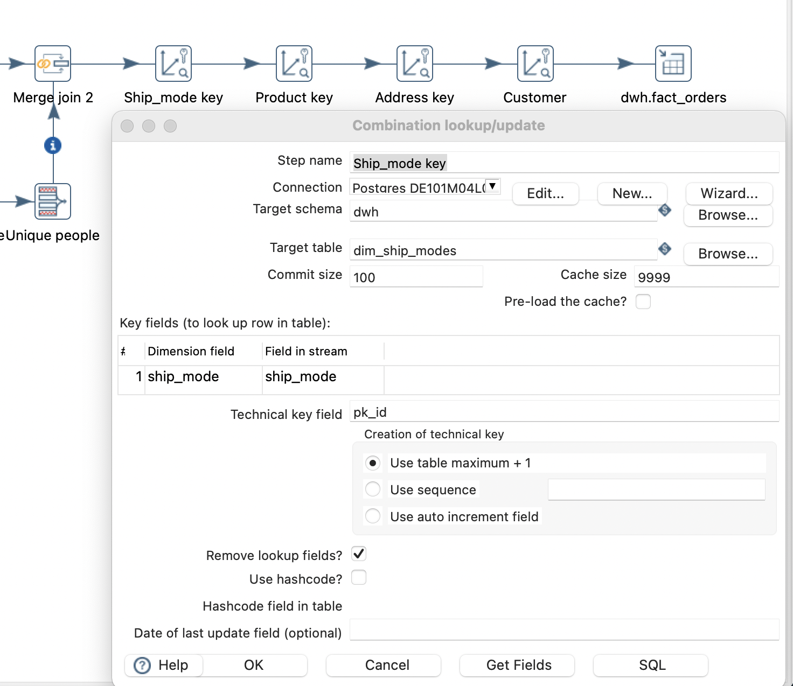
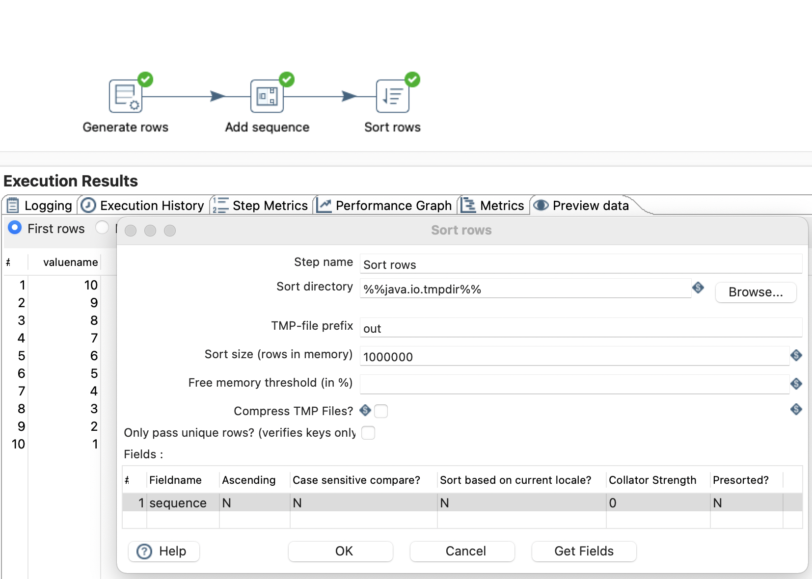

# Kimball's ETL Subsystems in Pentaho DI

Ralph Kimball defines 34 ETL subsystems divided into 4 key categories:
- [Extracting: Getting data into the data warehouse](#extracting-getting-data-into-the-data-warehouse)
- [Cleansing and conforming data](#cleansing-and-conforming-data)
- [Delivering: Prepare for presentation](#delivering-prepare-for-presentation)
- [Managing the ETL environment](#managing-the-etl-environment)

The purpose of this research is to find functions in Pentaho DI that allow to implement these subsystems. 

## Extracting: Getting data into the data warehouse

### Extract System (subsystem 3)

Pentaho DI provides plenty of tools that help user to connect to various all popular data sources including Excel, JSON, Zipped files, TXT files, many flavours of databases and even cloud storage. Here are some of them:

- Text file input
- JSON input
- Microsoft Excel input
- Table input
- MongoDB input
- Parquet input

## Cleansing and conforming data

### Data Cleansing System (subsystem 4)

### Error Event Tracking (subsystem 5)

There is out of the box logging and error handling functionality.

### Deduplication (subsystem 7)

The purpose of this system is to eliminate redundant rows from the data. 
    

## Delivering: Prepare for presentation

### Slowly Changing Dimension (SCD) Manager (subsystem 9)

SCD of various types could be implemented with Dimension lookup/update tool.

### Surrogate Key Generator (subsystem 10)

Surrogate keys could be generated using “Dimension lookup / update” and “Combination lookup / update”

### Fact Table Builders (subsystem 13)

### Surrogate Key Pipeline (subsystem 14)

## Managing the ETL environment

### Sorting (subsystem 28)

