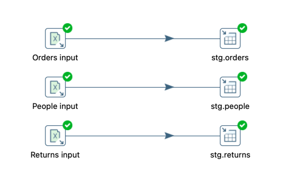
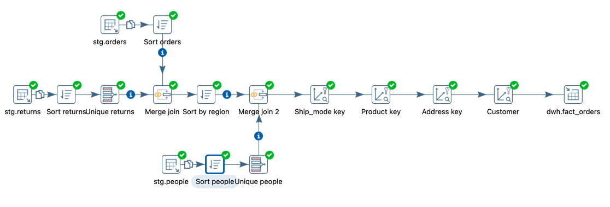
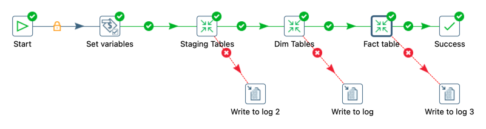
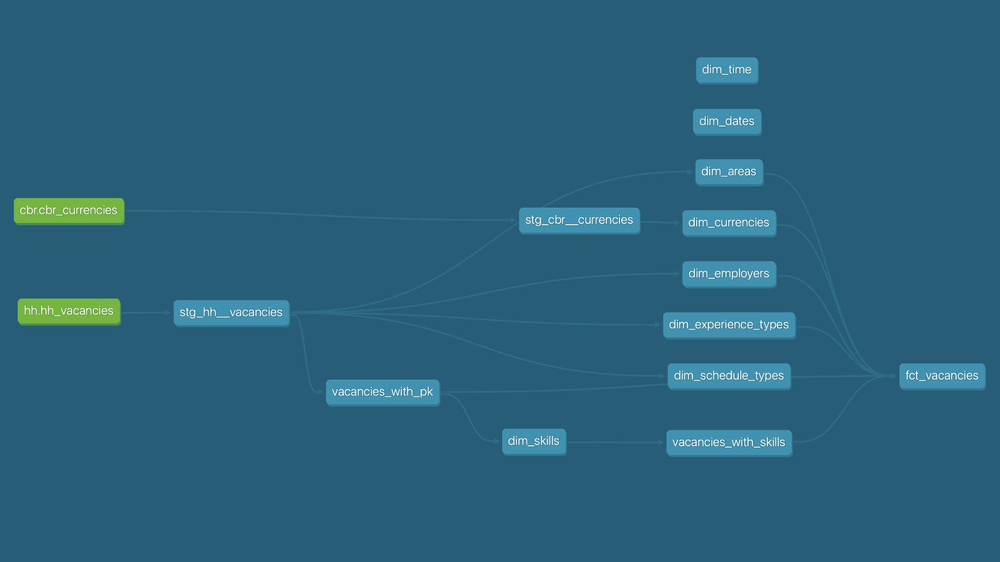
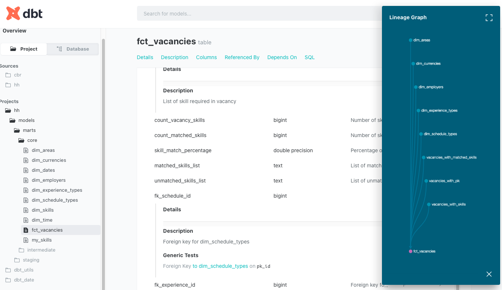
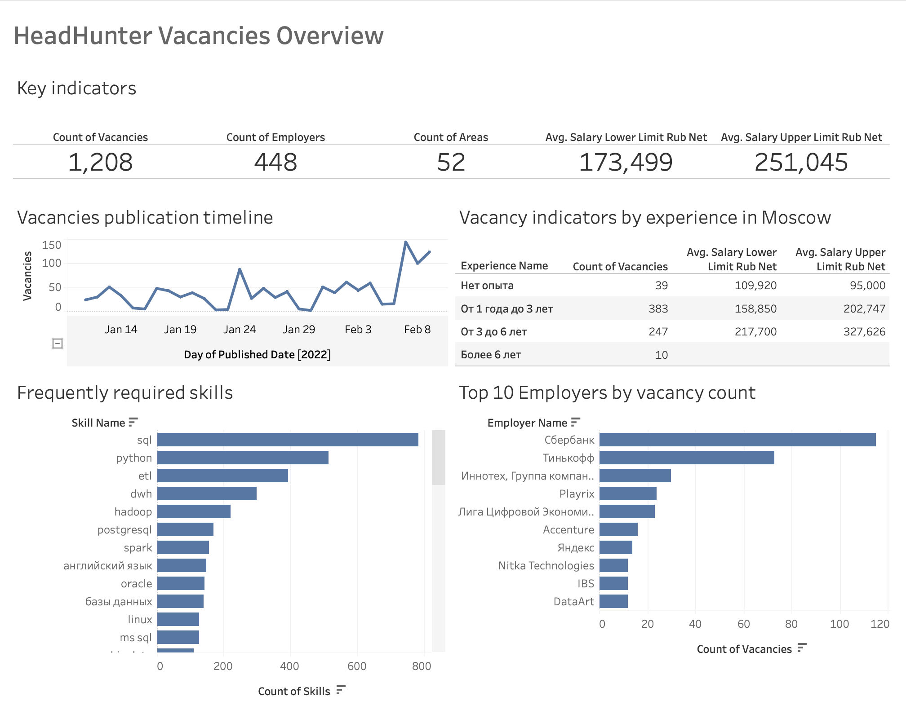
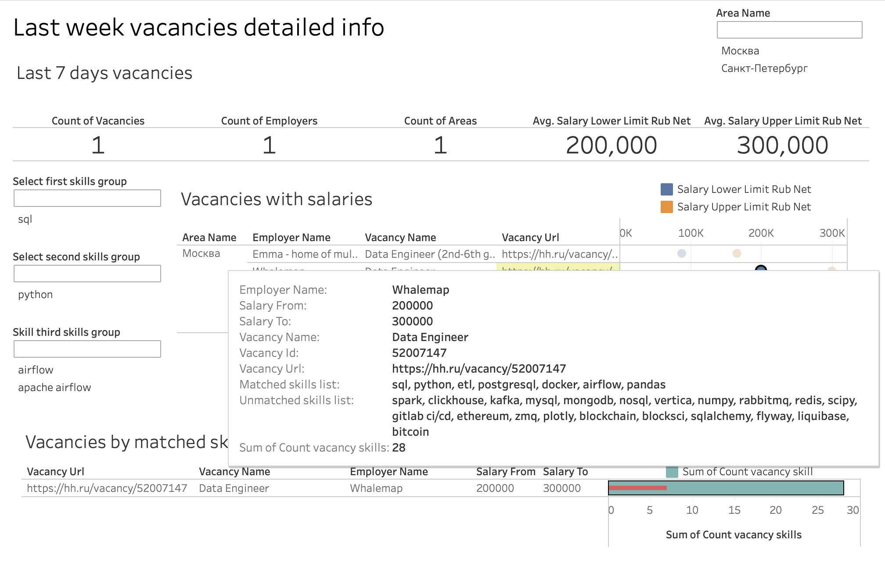

# DE-101 Module 4 Homework

## 4.4 ETL Components and Introduction to Pentaho Data Integration

### Task:
1. Download and install Pentaho DI
2. Finish stage and dimension transormations for Sample - Superstore data model from Module 2
3. Create fact table for fact_orders from Module 2

### Solution:
[Stage](./4/practice/stage.ktr)

[Dim](./4/practice/dim.ktr)

[Fact](./4/practice/fact.ktr)

[Job](./4/practice/job.kjb)

## 4.5 34 ETL Subsystems

### Part 1 - Pentaho DI overview

[ETL subsystems in Pentaho Data Integration](./5/etl%20subsystems.md)

### Part 2 - Excercises from Pentaho Data Integration Beginner's Guide - Second Edition

## 4.7 Fancy ETL

### Capstone project

As a capstone project for Module 4 i decided to build a data pipeline which fetches vacancies from HeadHunter API and currency rates from Central Bank API, and then loads data to a postgres database on a remote server. Data is used for a simple Tableau dashboard, that shows overview of the job market and helps user to find recently published vacancies based on the user skillset.

Project architecture

See the [Dag file](./7/airflow/hh/dags/fetch_vacancies.py)

Airflow techinques used:

- Developed a [hook](./7/airflow/hh/dags/hh/hooks.py) and an [operator](./7/airflow/hh/dags/hh/operators.py) for the HeadHunter API to fetch vacancies effectively
- Currency rates from the Central Bank API are fetched with simple BashOperator
- Upload to data warehouse uses the postgres hook, sqlalchemy and pandas(with some other packages) for data transformation

DBT:

Lineage Graph

Documentation

Tableau dashboard

Tableau dashboard with sample data snapshot is available on [Tableau Public](https://public.tableau.com/app/profile/kirill.avilenko8209/viz/Jobmarketanalysis-basedonHH_RUdata/Jobmarketoverview?publish=yes)

