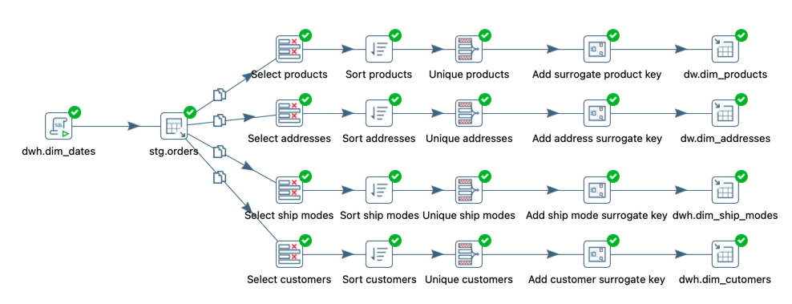

# DE-101 Module 4 Homework

## 4.4 ETL Components and Introduction to Pentaho Data Integration

### Task:
1. Download and install Pentaho DI
2. Finish stage and dimension transormations for Sample - Superstore data model from Module 2
3. Create fact table for fact_orders from Module 2

### Solution:
[Stage](./4/practice/stage.ktr)

[Dim](./4/practice/dim.ktr)

[Fact](./4/practice/fact.ktr)

[Job](./4/practice/job.kjb)

## 4.5 34 ETL Subsystems

### Part 1 - Pentaho DI overview

[ETL subsystems in Pentaho Data Integration](./5/etl%20subsystems.md)

### Part 2 - Excercises from Pentaho Data Integration Beginner's Guide - Second Edition
