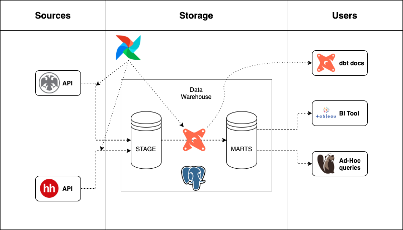
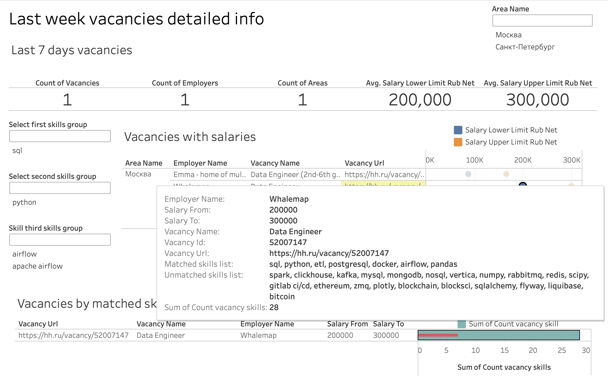

# Capstone project

As a capstone project for Module 4 I decided to build a data pipeline which fetches vacancies from HeadHunter API and currency rates from Central Bank API, and then loads data to a postgres database on a remote server. Data is used for a simple Tableau dashboard, that shows overview of the job market and helps user to find recently published vacancies based on the user skillset.

Project architecture

See the [Dag file](./7/airflow/hh/dags/fetch_vacancies.py)

Airflow techinques used:

- Developed a [hook](./7/airflow/hh/dags/hh/hooks.py) and an [operator](./7/airflow/hh/dags/hh/operators.py) for the HeadHunter API to fetch vacancies effectively
- Currency rates from the Central Bank API are fetched with simple BashOperator
- Upload to data warehouse uses the postgres hook, sqlalchemy and pandas(with some other packages) for data transformation

DBT:

Lineage Graph

Documentation

Tableau dashboard

Tableau dashboard with sample data snapshot is available on [Tableau Public](https://public.tableau.com/app/profile/kirill.avilenko8209/viz/Jobmarketanalysis-basedonHH_RUdata/Jobmarketoverview?publish=yes)

