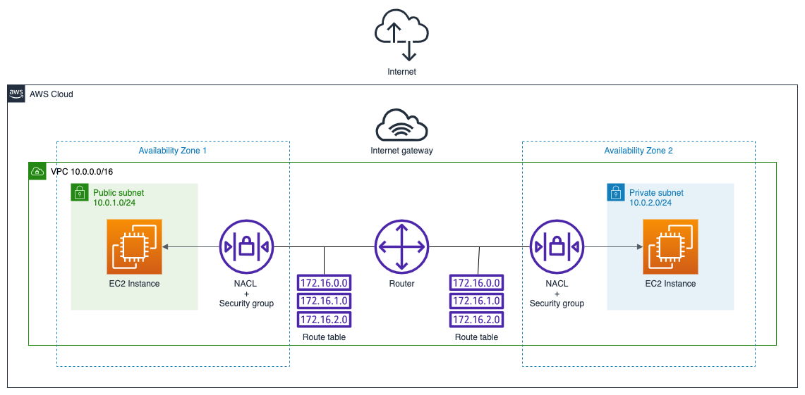

# DE-101 Module 5 Homework

## Homework 2

### Task

Create diagram and implement it with AWS Console for the following stack:
- VPC with public and private subnets in different availability zones
- Two EC2 instances - one in public and one in private subnets

### Solution

Solution implemented with 2 AWS CloudFormation stacks - one for [VPC and subnets](./2/lab2-vpc.yaml) and the other for [ec2 instances](./2/lab2-ec2.yaml).

## Homework 3

### Task

- Create two EC2 instances, connected to Application Load Banacer. 
- Install and start apache web server on each instance.
- Stop one of the instances and check website availability.
- Create diagram for the implemented architecure

### Solution

